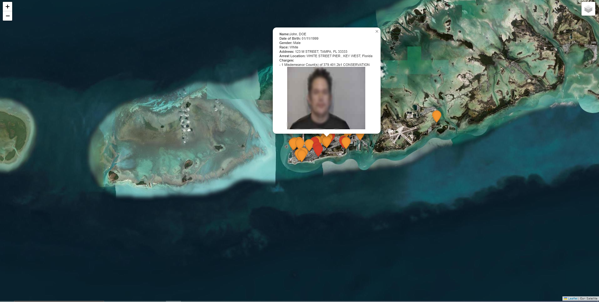
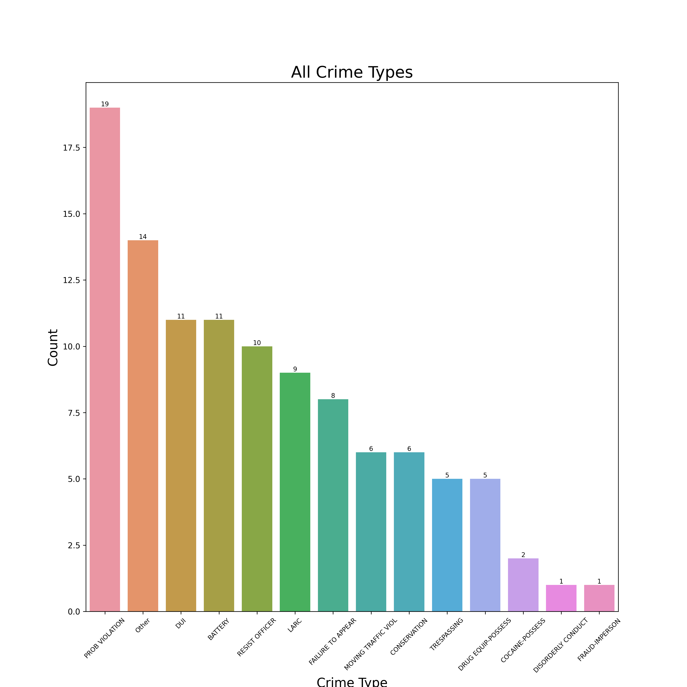

# Arrest-Data-Visualization-and-Mapping
 
This script collects arrest data from the Monroe County Sheriff's Office, geocodes the arrest locations using the Geoapify API, and visualizes the data with a folium map and a bar chart which shows the most common charges.

## Requirements
- Python 3.x
- Libraries: requests, csv, folium, os, concurrent.futures, datetime, bs4, pandas, matplotlib, seaborn

## Setup
1. Obtain a Geoapify API key and set it as the value of API_KEY.
2. Ensure that the required libraries are installed by running pip install pandas folium requests.
3. Run the main.py script.

## Data Collection
The script starts by setting up the necessary variables, creating a 'data' directory with the current date and defining the geocode_address function to geocode addresses using the Geoapify API.
It then sends scrapes the website using BeautifulSoup and extracts the relevant data.
The extracted data, including name, date of birth, age, gender, race, address, occupation, arrest location, charges, and image path, is saved to a CSV file named arrests-{today}.csv within the 'data' directory.
For each arrest record, the script also downloads the associated image, saves it to the 'data' directory, and stores the image URLs and file paths for later use in creating the folium map.
The images are then downloaded in parallel using ThreadPoolExecutor.

## Data Visualization
The script reads the CSV file with pandas to obtain the charges data.
It then extracts the relevant crime type from each charge and counts the occurrences of each crime type.
The crime type counts are visualized using a bar chart created with matplotlib and seaborn. The chart is saved as an image named all_crime_types.png in the 'data' directory.

## Folium Map Creation
For each arrest record with valid coordinates, the script adds a marker to the folium map with a popup containing relevant information, including the image of the person.
The markers are colored based on whether any of the charges are classified as felonies. Felony charges are represented by red markers, while other charges are represented by orange markers.
The map is saved as an HTML file named arrest_map-{today}.html in the 'data' directory.

## HTML MAP

## Bar Graph

